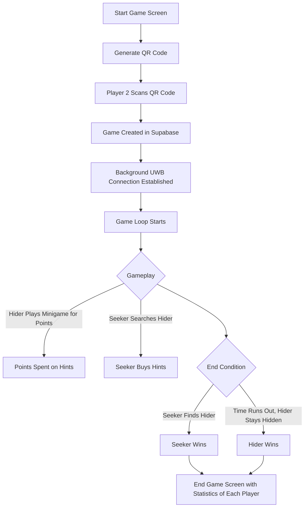
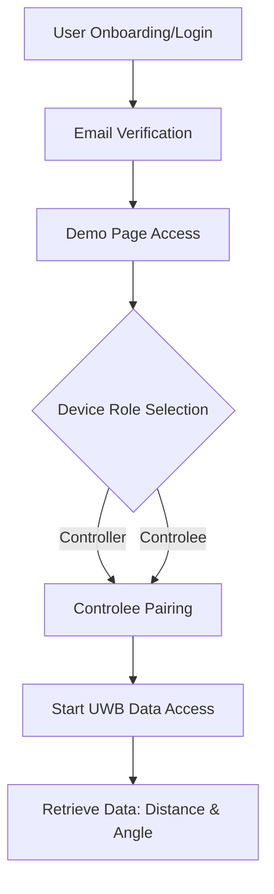

## 📱 Relative Location of Two Smartphones

### 📝 Table of Contents

- [📱 Relative Location of Two Smartphones](#-relative-location-of-two-smartphones)
  - [📝 Table of Contents](#-table-of-contents)
  - [1. 💡 Project Overview](#1--project-overview)
    - [1.1 Project Name](#11-project-name)
    - [1.2 Project Description](#12-project-description)
    - [1.3 🎯 Objectives](#13--objectives)
  - [2. 📋 Team Project Summary](#2--team-project-summary)
  - [3. 📷 Application User Manual](#3--application-user-manual)
  - [4. ✨ Features](#4--features)
  - [5. ⚙️ Technologies Used](#5-️-technologies-used)
  - [6. 📝 Diagrams](#6--diagrams)
    - [6.1 🔄 Game Loop Flow](#61--game-loop-flow)
    - [6.2 📶 UWB Page Access Flow](#62--uwb-page-access-flow)
  - [7. 📊 Measurement Results](#7--measurement-results)
  - [8. 📜 System Requirements](#8--system-requirements)
  - [9. 🛠️ Application Configuration Instructions](#9-️-application-configuration-instructions)

---

### 1. 💡 Project Overview

#### 1.1 Project Name

**_SeekMate_** – Hide and Seek game based on relative location of 2 phones connected via UWB technology.

#### 1.2 Project Description

Utilizes Ultra-Wideband (UWB) technology to create a turn-based mobile game of Hide and Seek on Android. Seekers receive hints to locate the hider based on UWB proximity and direction.

#### 1.3 🎯 Objectives

-   Develop an Android app capable of measuring the relative positions of two smartphones.
-   Analyze mutual location data, including accuracy measurements.

---

### 2. 📋 Team Project Summary

[🔗 Go to Team Project Summary](./docs/TaskSummary.md)

---

### 3. 📷 Application User Manual

To provide a visual understanding of the app's interface and functionalities, we have compiled a collection of screenshots in a PDF document. You can access it using the link below:

[🔗 View Application Manual (PDF)](./docs/assets/User_Manual_Seekmate.pdf)

### 4. ✨ Features

-   **📱 Relative Location Recording**: Real-time measurement of relative positions between paired devices via UWB
-   **🔗 Pairing UWB Phones via QR Code**: Device pairing for improved convenience
-   **🎯 360° Directional Arrow**: Visual arrow pointing to the other device, dynamically updating within 360 degrees
-   **📏 Accuracy Metrics**: Display the location measurements.
-   **☁️ Cloud Integration**: Synchronize data with cloud storage solutions.

---

### 5. ⚙️ Technologies Used

The project uses the following technologies:

-   **Kotlin**: Primary programming language for Android development.
-   **[Supabase](https://supabase.com/)**: Backend-as-a-Service for authentication and data storage.
-   **[Kotlin Supabase Client](https://supabase.com/docs/reference/kotlin/introduction)** Supabase's Kotlin Android library
-   **[Android UWB Library](https://developer.android.com/jetpack/androidx/releases/core-uwb)**: A library for Ultra-Wideband (UWB) proximity sensing and location tracking.

---

### 6. 📝 Diagrams

#### 6.1 🔄 Game Loop Flow

#### 6.2 📶 UWB Page Access Flow

---

### 7. 📊 Measurement Results

[🔗 Go to Measurement Results](./docs/measurements/Measurements.md)

---

### 8. 📜 System Requirements

-   **OS**: Android 15
-   **AGP**: Android Gradle plugin 8.8.0
-   **Hardware**: Devices with Ultra-Wideband (UWB) capability
-   **Network**: Access to internet for Supabase functionalities

---

### 9. 🛠️ Application Configuration Instructions

[🔗 Go to Instructions](./docs/configuration/Supabase.md)

---
