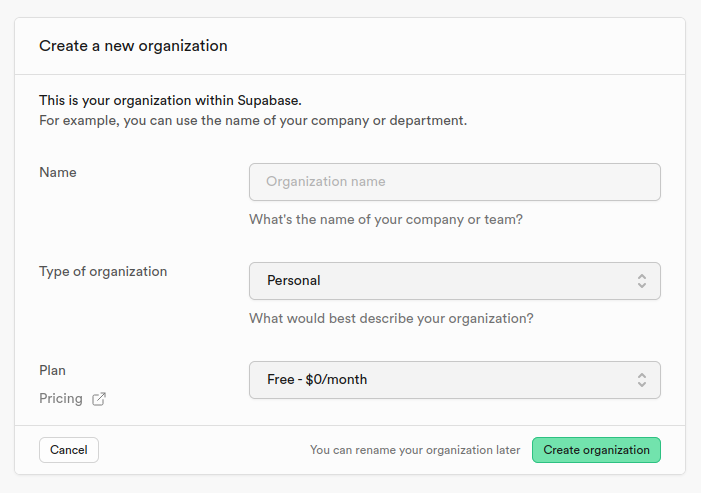
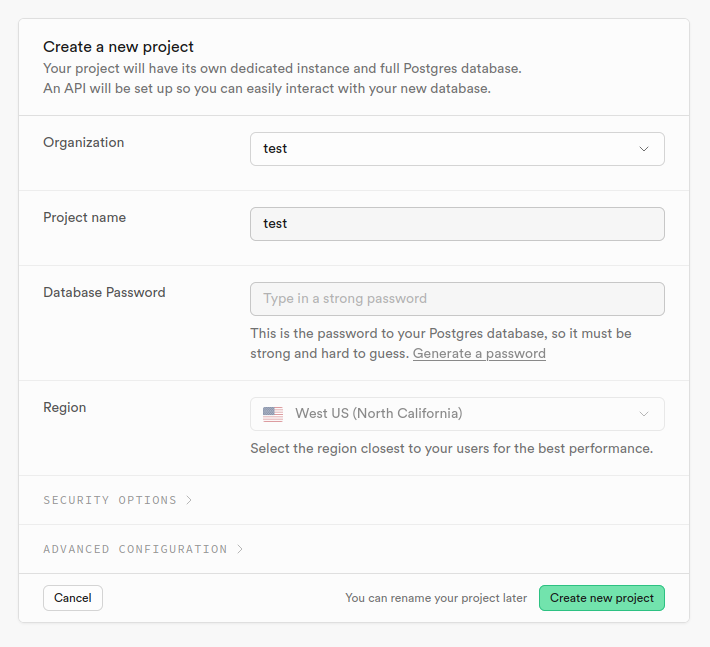
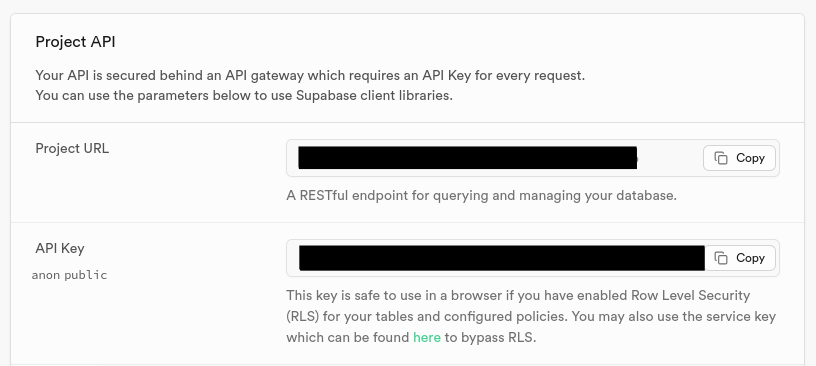
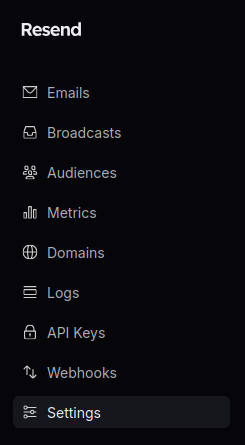
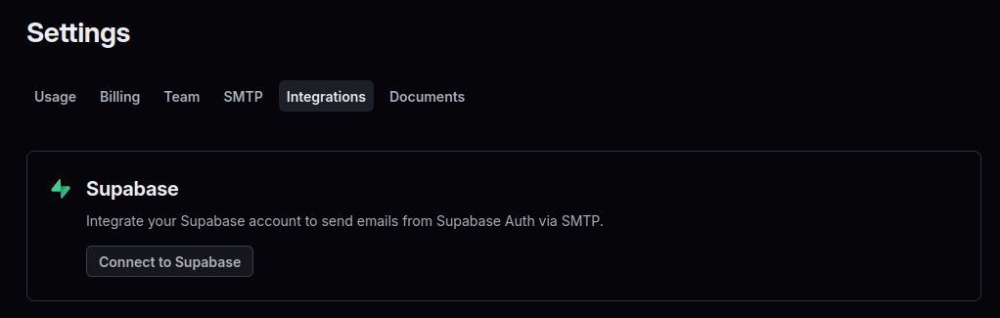
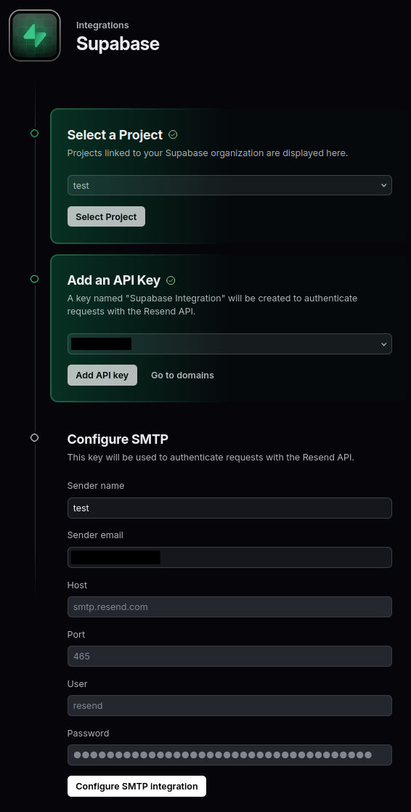
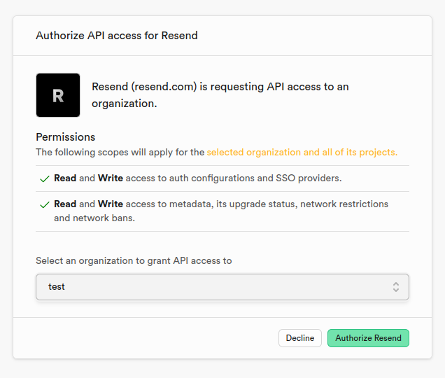
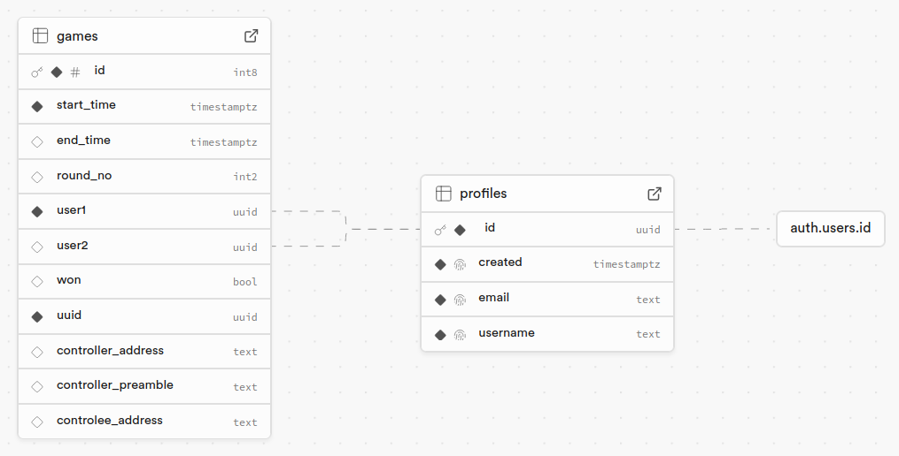
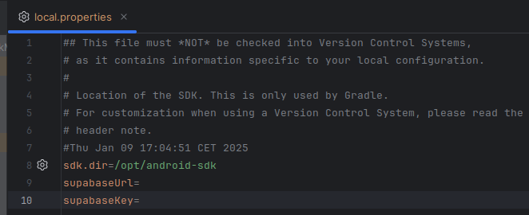

## Supabase configuration

### Table of Contents

- [Supabase configuration](#supabase-configuration)
  - [Table of Contents](#table-of-contents)
  - [1. Supabase project](#1-supabase-project)
    - [1.1 Create a Supabase account](#11-create-a-supabase-account)
    - [1.2 Create organization](#12-create-organization)
    - [1.3 Create project](#13-create-project)
    - [1.4 Save API URL and key](#14-save-api-url-and-key)
  - [2. Email configuration](#2-email-configuration)
    - [2.1 Create a Resend account](#21-create-a-resend-account)
    - [2.2 Go to Settings](#22-go-to-settings)
    - [2.3 Go to Integrations](#23-go-to-integrations)
    - [2.4 Configure the Integration](#24-configure-the-integration)
    - [2.5 Grant access](#25-grant-access)
  - [3. Database configuration](#3-database-configuration)
    - [3.1 Create tables](#31-create-tables)
    - [3.2 Make table Game realtime and disable RLS](#32-make-table-game-realtime-and-disable-rls)
  - [4. Configure API in app](#4-configure-api-in-app)
    - [4.1 Add saved properties to the local.properties file](#41-add-saved-properties-to-the-localproperties-file)

---

### 1. Supabase project

#### 1.1 Create a [Supabase](https://supabase.com/) account

#### 1.2 Create organization

#### 1.3 Create project

#### 1.4 Save API URL and key

---

### 2. Email configuration

#### 2.1 Create a [Resend](https://resend.com/) account

#### 2.2 Go to Settings

#### 2.3 Go to Integrations

#### 2.4 Configure the Integration

#### 2.5 Grant access

---

### 3. Database configuration

#### 3.1 Create tables

#### 3.2 Make table Game realtime and disable RLS

---

### 4. Configure API in app

#### 4.1 Add saved properties to the local.properties file

---
